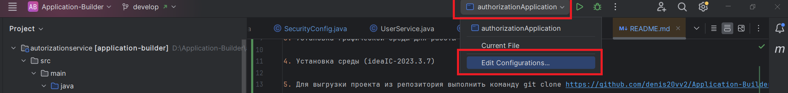
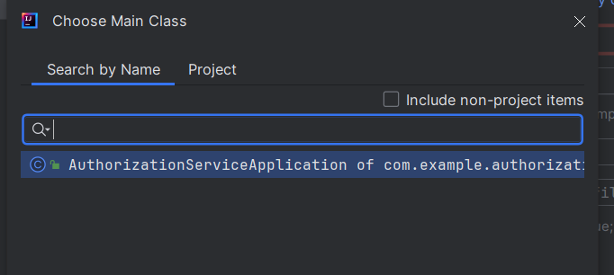

# Sportswear Backend

Ссылка на утилиты: https://disk.yandex.ru/d/5WZudjxqOaKm7Q

## 1. Установка java (File->Project stricture -> Project -> в поле SDK выбрать Download sdk -> выбрать версию 21, microsoft openJDK 21.0.10)

## 2. Установка БД (файл postgresql-17.0-rc1-windows-x64)

В процессе установки выбрать следующие логин и пароль для супер юзера:
username=postgres
password=123456

## 3. Установка графической среды для работы с БД Pgadmin (pgadmin4-8.11-x64)

## 4. Установка среды (ideaIC-2023.3.7)

## 5. Открыть папку проекта из IntelliJ Idea

## 6. На верхней панели выбрать "edit configurations" -> Затем "edit configurations", в открывшемся окне выбрать "Add new configuration"




затем "Application", выбрать sdk 21 и в поле "main class" прописать "SportswearApplication".



По кнопке на верхней панели "Run SportswearApplication" можно запустить проект

В случае если вылетит ошибка установки jdk, то на верхней панеели Main menu выбрать File -> Project structure,
add new sdk -> add jdk -> Указать путь к jdk-21 (Если удобнее можно установить другой пакет: download jdk -. выбрать 21 версию)

##Настройка БД
- Для настройки БД нужно зайти в pgAdmin (при входе на сервер потребуется ввести пароль супер юзера)
- Создать новую БД с названием "sportswear_db"
- Порт: 5432


## Карта проекта

- Технологии: Java 21, Spring Boot 3, Spring Web, Spring Data JPA, PostgreSQL, Flyway, Swagger/OpenAPI.
- Точка входа: `SportswearApplication`.
- Архитектура построена по фичам в `src/main/java/.../core/*`.

Структура каждого доменного модуля:
- `domain` — JPA-сущности (модели таблиц БД).
- `rep` — репозитории (`JpaRepository` / `JpaSpecificationExecutor`).
- `service` — бизнес-логика, фильтрация, пагинация, сортировка.
- `web` — REST-контроллеры.
- `view` — DTO/представления для ответов API.

Основные группы модулей:
- Каталог товаров: `ball`, `shoes`, `inventory`, `accessories`, `shorts`, `tshirts`, `protectivecloth`, `gloves`, `gaiters`, `jacket`, `pants`, `sweater`, `sportsunderwear`.
- Контент и навигация: `page`, `menu`, `product`, `contactinfo`, `filter`.
- Заказы: `order`.
- Медиа: `image`.

## Как это работает

Базовый поток обработки запроса:

`HTTP запрос -> Controller -> Service -> Repository -> PostgreSQL -> DTO/View -> JSON ответ`

Что делает система:
- Модули каталога отдают список товаров и карточку товара по id.
- Сервисы собирают фильтры, сортировку и пагинацию, формируют ответ вида `items + count`.
- `page` отдает структуру страницы.
- `menu` строит иерархию пунктов меню.
- `order` принимает заказ (`POST /api/order`) и сохраняет его в `orders`.
- `image` раздает файлы изображений (`GET /images/{imageName}`).

## Как запускать

### 1. Подготовить окружение

- Установить JDK 21.
- Установить PostgreSQL (порт `5432`).
- Установить pgAdmin (по желанию, для удобной работы с БД).
- Создать БД `sportswear_db`.

Параметры подключения по умолчанию:
- `username=postgres`
- `password=123456`

### 2. Проверить конфигурацию приложения

Файл: `src/main/resources/application.properties`

Ключевые параметры:
- `spring.datasource.url=jdbc:postgresql://localhost:5432/sportswear_db`
- `spring.datasource.username=postgres`
- `spring.datasource.password=123456`
- `server.port=8080`
- Flyway миграции включены (`spring.flyway.enabled=true`)

### 3. Запустить проект

Вариант через IntelliJ IDEA:
- Открыть проект.
- Создать конфигурацию типа `Application`.
- Указать main class: `SportswearApplication`.
- Запустить конфигурацию.

Вариант через Maven:
```bash
mvn spring-boot:run
```

### 4. Проверить, что все работает

- Backend: `http://localhost:8080`
- Swagger UI: `http://localhost:8080/swagger-ui.html`

## Взаимодействие модулей

- Frontend (обычно `http://localhost:3333`) обращается к backend по `/api/...`.
- Контроллеры принимают query-параметры (`page`, `size`, фильтры, сортировку).
- Сервисы применяют бизнес-правила и формируют запросы к БД.
- Репозитории читают/пишут данные в PostgreSQL.
- Flyway при старте приложения применяет миграции:
  - `V1__create_page_tables.sql` — создание таблиц;
  - `V2__insert_page_tables.sql` — начальное заполнение данных.
